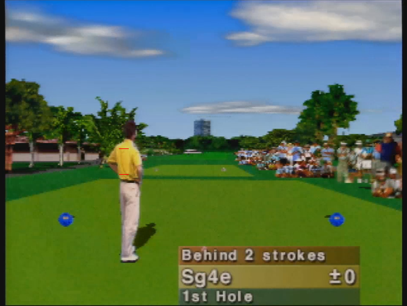

# Waialae Autosplitter

[LiveSplit](https://github.com/LiveSplit/LiveSplit) autosplitter for *Waialae Country Club: True Golf Classics* for the Nintendo 64.

By sg4e.

## How it works

The autosplitter captures your gamefeed and activates on the fadeout after each hole. There are no dependencies; if you can see your gamefeed on your computer monitor (e.g., in an emulator or a video-capture device from console), Waialae Autosplitter will work for you!

## How to use

Waialae Autosplitter supports Windows 32- and 64-bit builds. DirectX 11 is required.

0. Set up LiveSplit to work with Waialae Autosplitter.
  * "Edit Layout" -> Add -> "Control" -> "LiveSplit Server" -> "Ok".
  * Right-click on your splits window -> "Control" -> "Start Server". *You must start the server every time you re-open LiveSplit.*
1. Download the latest [release](https://github.com/sg4e/waialae-auto-splitter/releases) for your CPU architecture.
  * 32-bit: `waialae-auto-splitter--i686-pc-windows-msvc.zip`
  * 64-bit: `waialae-auto-splitter--x86_64-pc-windows-msvc.zip`
2. Extract the ZIP archive.
3. Double-click on `waialae-auto-splitter.bat` to run.
4. Follow the prompts in the console to configure your capture.

Waialae Autosplitter does not currently support the final split (when ball enters hole on Hole 18). The following commands may be used in console for manual control as needed:
* `[Enter]`: Split
* `r [Enter]`: Reset
* `s [Enter]`: Skip split
* `u [Enter]`: Undo split
* `[Ctrl]+C`: Exit

When using Waialae Autosplitter for starting the timer (when golfer appears on Hole 1), examine the following image for guidance on how to frame the yellow shirt's capture:

## Troubleshooting

*A window pops up indicating a library or DLL is missing.*

Make sure you have installed the latest [Microsoft C++ Redistributable](https://support.microsoft.com/en-us/help/2977003/the-latest-supported-visual-c-downloads).

## TO-DO

- Add autosplit capability for start of run (when golfer appears)
- Move hardcoded settings to standalone configuration file
